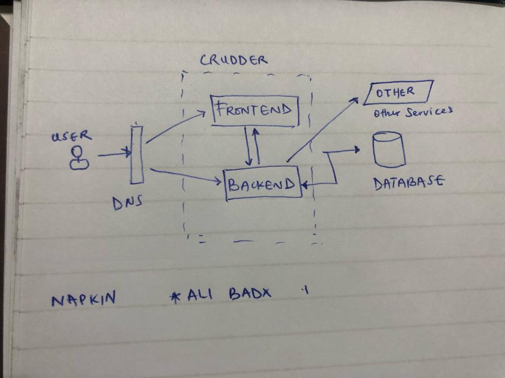

# Week 0 — Billing and Architecture

## Required attachments/Tasks

I used Gitpod for the development 

The first napkin drawing which gives a summary of the application and  explains the project is shown below 

### Napkin Diagram

### Lucid Diagram
The main architecture diagram of the application which shows all the services that are used are presented using a Lucid drawing diagram at the 
[Lucid diagram for the crudder app architecture](https://lucid.app/lucidchart/15a19686-8400-4096-9b06-4cdd91dfb4db/edit?view_items=tczAcRWK.mP0&invitationId=inv_6042fce4-b744-4895-9c28-a94629a3e498)

This gives the overall services which would be used for this project

We first create a root user account on [AWS](aws.account.com) and set the Multi-factor authentication. This gives a second layer of protection to our account.
We create user groups (eg Engineering) to assign users to and give them access to certian services using the IAM Roles through policies. 

### Aws Cli installation
We therefore install the cli using the information from the [aws cli installation guide](https://docs.aws.amazon.com/cli/latest/userguide/getting-started-install.html)

It is adviced to only use the IAM user which we create to perform any actions which we would need. The IAM Root user generates aws cli credentials from access keys  which IAM users would use to access the aws account infrastructure. The credentials are confirmed using the cli command 

>  aws sts get-caller-identity 

 ### Budget Alarm
 AWS spend is very important for this project considering our aim to minimise cost and use only the free tier services provided by AWS. 

So we have setup a budget and billing alarm system which notifies us through email on subscription to an SNS topic when certian thresholds are reached in the project. 
only one budget was created so we can create another when it is needed again since the maximum free tier allows only two

